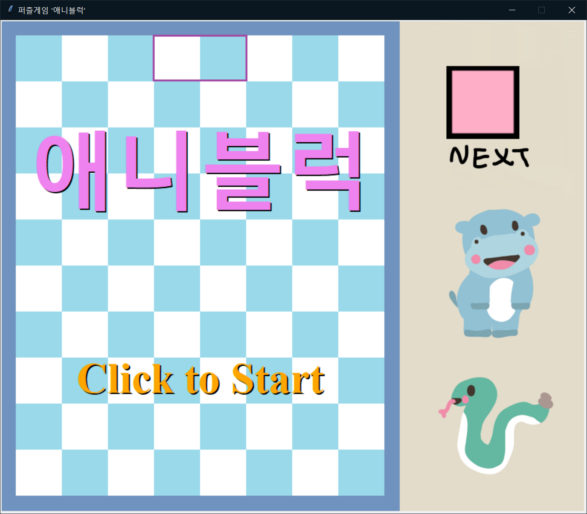
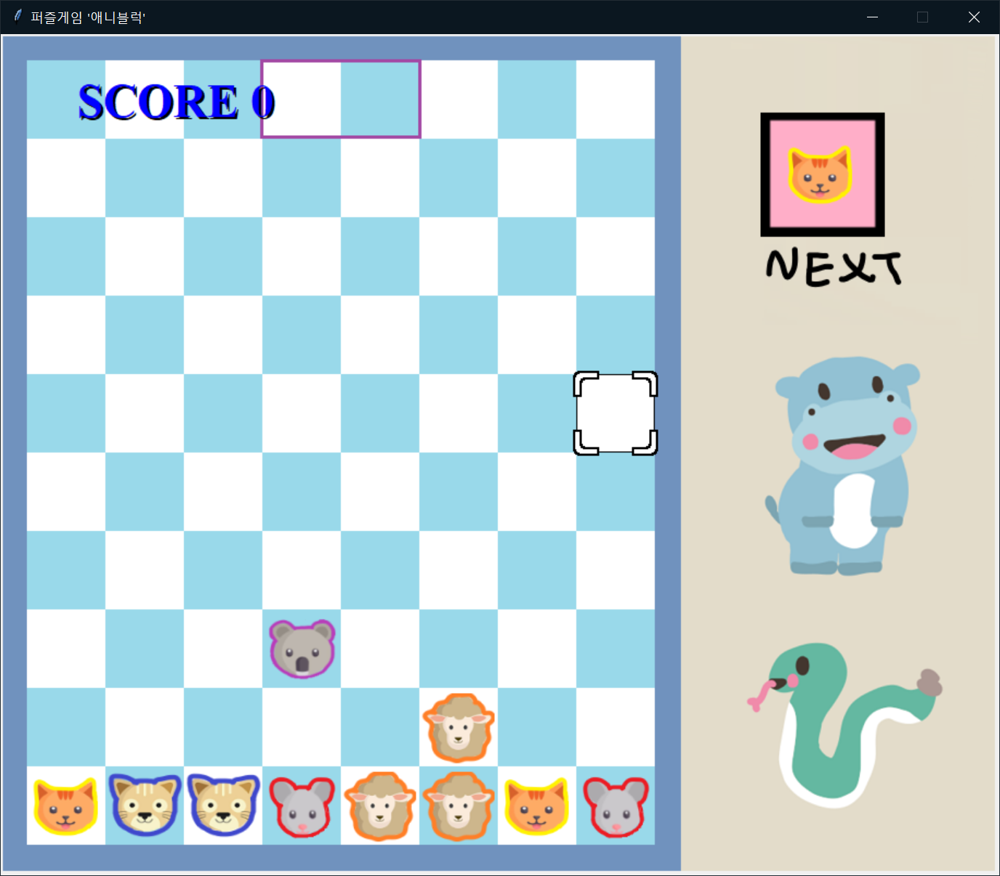

# GameStudy-Python-JPub_PyGame1
애니블럭 게임 (파이썬으로 배우는 게임 개발 입문편 - Jpub)

&nbsp;

### 개발기간 🏗️
* 2021.04.22 ~ 2021.04.27, 2021.10.29
   
### 기술 📚
* Language
 * Python (3.9.4)
* FE
 * tkinter
* build
 * py2exe (Windows)

### 배운 것 📖
* 절차지향 게임 개발
  * tick
  * EventHandling
  * State Management
* Score System
* GameOver & Restart

### 빌드 방법 👷‍♂️ (Windows)
 * prerequisite
   * python ([3.9.4](https://www.python.org/downloads/))
   * tkinter
     * `sudo apt-get install python3-tk`
 * `...\JPub_PyGame1>python3 setup.py py2exe`
   * dist에 output 생성됨

### 실행 방법 🏃 (Ubuntu / Mac)
* prerequisite
  * python ([3.9.4](https://www.python.org/downloads/))
  * tkinter
    * Mac:
      `brew install tcl-tk`
      `pip3 install Pillow`
    * Ubuntu:
      `sudo apt-get install python3-tk`
      `sudo apt-get install python3-pip`
      `pip3 install Pillow`
* run
  * `python3 BlockDropGame.py`
